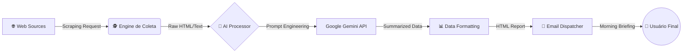

# 📡 AI-Radar ETL: Pipeline Automatizado de Inteligência


> **Um pipeline ETL autônomo que monitora, filtra e sintetiza notícias de mercado utilizando Inteligência Artificial Generativa.**

---

## 🎯 O Problema
Manter-se atualizado com o volume massivo de notícias sobre tecnologia e IA consome horas valiosas. Feed readers tradicionais apenas agregam links, exigindo leitura manual e filtro de ruído.

## 💡 A Solução
O **AI-Radar ETL** não é apenas um raspador. É um **agente de curadoria**. Ele automatiza o ciclo de inteligência:
1.  **Extract (Extração):** Monitora múltiplas fontes de notícias em tempo real.
2.  **Transform (Transformação):** Utiliza o LLM **Google Gemini** para ler o conteúdo, filtrar o que é irrelevante (ruído) e gerar resumos executivos focados em impacto técnico.
3.  **Load (Carregamento):** Compila um relatório estruturado e envia via e-mail matinal automatizado.

---

## 🏗️ Arquitetura do Sistema

O fluxo de dados segue uma abordagem linear de pipeline:



🛠️ Tech Stack
Linguagem: Python 3.x

Core AI: Google Generative AI SDK (google-generativeai)

Orquestração/Dados: Pandas (Manipulação de Dataframes), Requests/BeautifulSoup (Coleta).

Notificações: SMTP Lib (Automação de e-mail).

Segurança: Gestão de credenciais via Variáveis de Ambiente (python-dotenv).

🚀 Como Rodar Localmente
Pré-requisitos
Python instalado.

Uma API Key do Google Gemini (AI Studio).

Uma senha de aplicativo do seu provedor de e-mail (para envio SMTP).

Instalação
Clone o repositório:

```Bash

git clone https://github.com/IsantoDev/radar-etl.git
cd radar-etl
Instale as dependências:
```

```Bash

pip install -r requirements.txt

```
Configure o Ambiente: Crie um arquivo .env na raiz do projeto e adicione suas chaves (NUNCA suba suas chaves para o GitHub!):

```Bash
Snippet de código

GEMINI_API_KEY="sua_chave_aqui"
EMAIL_SENDER="seu_email@gmail.com"
EMAIL_PASSWORD="sua_senha_de_app"
EMAIL_RECEIVER="email_destino@gmail.com"
Execute a Pipeline:
```

```Bash

python main.py
```

🧠 Destaques de Engenharia (Why this matters)
Semantic Filtering: Ao contrário de filtros baseados em palavras-chave (Regex), este projeto usa a compreensão semântica do LLM para decidir se uma notícia é realmente sobre "Avanços em IA" ou apenas marketing, reduzindo falsos positivos.

Prompt Engineering: O sistema utiliza prompts otimizados para garantir que os resumos sejam técnicos e diretos, evitando alucinações comuns em modelos de linguagem.

Robustez: Tratamento de erros para falhas de requisição e limites de quota da API.


👨‍💻 Autor
Desenvolvido por Igor Santos Engenheiro de Automação & IA em formação
